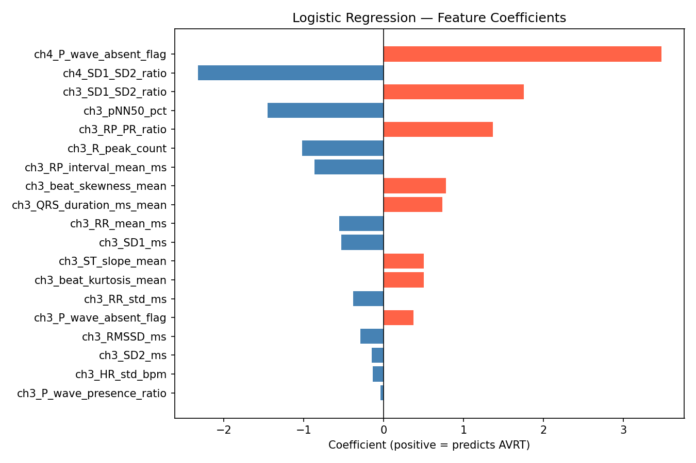
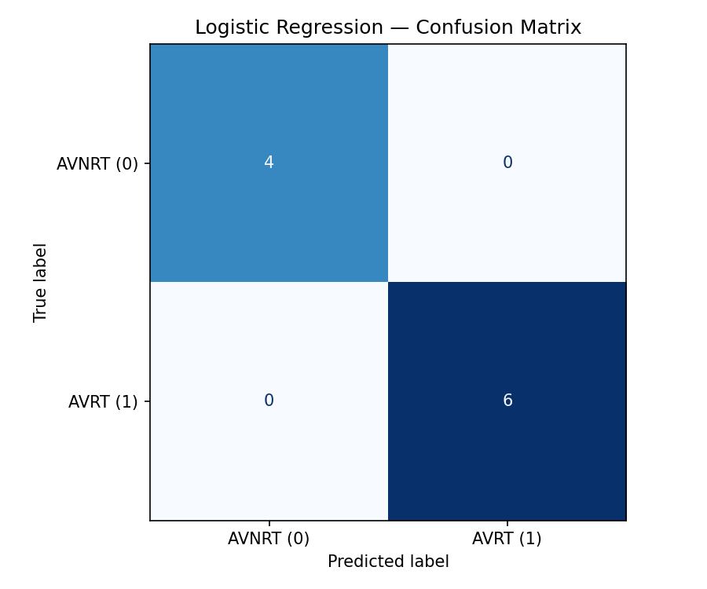

# ECG-Based AVNRT vs AVRT Classification

**Deep Learning for Cardiac Health Monitoring (Summer 2026 research internship)**
Ultrasound & Elasticity Imaging Laboratory (UEIL), Columbia University

A signal-processing and machine-learning pipeline that tells apart the two most common
re-entrant supraventricular tachycardias, **AVNRT** (AV nodal re-entrant tachycardia) and
**AVRT** (AV re-entrant tachycardia via an accessory pathway), using 3-channel
intraoperative ECG.

> **Data notice:** this repository contains code, methods and aggregate results only.
> It includes no patient recordings, extracted feature tables, per-recording
> predictions, dates or identifiers. See [`data/README.md`](data/README.md).

---

## Why it matters

Telling AVNRT from AVRT on the surface ECG usually relies on finding the retrograde P
wave and measuring the RP interval. At heart rates above 200 BPM, the P wave is often
buried in the QRS or T wave, which makes manual reading unreliable. Most published ML
work covers the easier SVT-vs-VT problem. AVNRT vs AVRT is a harder distinction
*within* SVT, and the best 12-lead CNN baseline I found reports about 0.77 AUC.

## Pipeline

```
 .mat ECG (10 kHz, ~7.5 s, ch1/ch3/ch4)
        │
        ▼
 Butterworth band-pass 0.5–50 Hz  (order 4, SOS, zero-phase)
        │
        ▼
 R-peak detection  (scipy find_peaks, 200 ms refractory)
   └─ NeuroKit2 Pan-Tompkins bypassed: it halves beat count at 210+ BPM
        │
        ▼
 Waveform delineation  (NeuroKit2 DWT → P / Q / S / T onsets, peaks, offsets)
        │
        ▼
 Feature extraction: ~90 features × channel, 8 categories
   HRV · morphology · intervals (RP, VA, RP/PR) · QRS alternans ·
   spectral · Poincaré / nonlinear · DWT energy · R-peak stats
        │
        ▼
 Feature selection  (Mann-Whitney U, p < 0.05, effect size, NaN rate) → 19 features
        │
        ▼
 Logistic Regression  ·  Random Forest  ·  XGBoost
   stratified 80/20 split · 5-fold GridSearchCV · Leave-One-Out CV
```

## Dataset (private)

| | AVNRT (class 0) | AVRT (class 1) | Total |
|---|---|---|---|
| Patient sessions | 8 | 7 | 15 |
| Recordings | 20 | 26 | **46** |

Channels 3 (primary) and 4 were used. Channel 1 was excluded because it was noisy.

## Results

The primary metric is Leave-One-Out CV accuracy, chosen because n = 46 is too small for a
reliable single hold-out split.

| Model | Best hyper-parameters | LOO-CV accuracy | 5-fold CV accuracy | Correct (LOO) |
|---|---|---|---|---|
| Logistic Regression | C = 10, L2, saga | 80.4% | 83.6% | 37 / 46 |
| Random Forest | 50 trees, max_depth 3, balanced | 78.3% | 78.6% | 36 / 46 |
| **XGBoost** | 100 trees, max_depth 2, lr 0.1 | **89.1%** | 77.9% | **41 / 46** |
| *Reference: 12-lead CNN (literature)* | | *≈ 0.77 AUC* | | |

<p align="center">
  
  
</p>

### Additional experiments (see [results slides](reports/ECG_Feature_Extraction_Results_Slides.pdf))
- **SVM** was added as a fourth model. It reached 82.6% LOO-CV and 86.1% 5-fold CV on the full 46-recording set.
- **Clean subset (24 recordings)** kept only signals that passed the SNR > 0.5 check and visual
  inspection. Here the simpler models did best: Logistic Regression and SVM scored 79–85%.
- **SHAP** values were above 0.3 for half of the features, which supports the feature selection.
- **Zero-crossing (ZC) extension:** the same ECG features were added to the lab's
  electromechanical-wave-imaging zero-crossing dataset, to predict whether a strain-curve zero
  crossing is correct. Five models were tested (LogReg, RF, XGBoost, CatBoost, LightGBM) with
  patient-level 80/20 validation. CatBoost did best, with ROC-AUC 0.881 → 0.910 after adding
  spatial features and **0.917 ROC-AUC / 0.733 F1** after spatial feature engineering. Spatial
  features mattered more than the extra ECG features.

### Findings
- **pNN50, heart-rate variability and QRS morphology** (skewness, kurtosis, duration)
  were the most discriminative features.
- **RP interval** separated the classes clearly (Cohen's d = 1.06, p = 0.001), but about
  28% of values were missing at 200+ BPM.
- Most logistic-regression coefficient signs agree with known AVNRT/AVRT
  electrophysiology. The few that don't (RP interval, QRS duration, R-peak count) are
  explained by multicollinearity among correlated features.

### Limitations
- **3 channels instead of 12 leads.** The pseudo-R′ in V1 and pseudo-S in the inferior
  leads, which are highly specific for AVNRT, can't be measured.
- **Small cohort.** Leave-One-Out here is per *recording*, so recordings from the same
  patient can end up in both training and test folds. Patient-grouped CV and an
  independent cohort are the next validation steps.
- **RP detection at high rates.** Above 200 BPM the delineator can pick up the next
  beat's P wave, which inflates RP values (about 148 ms for AVNRT and 182 ms for AVRT,
  against the clinical cutoff of < 90 ms).

## Repository structure

```
├── src/
│   ├── ecg_features.py        # filtering, delineation, 8 feature-extractor families
│   ├── extract_features.py    # batch pipeline → feature matrix (anonymised IDs)
│   └── train_models.py        # LR / RF / XGBoost, GridSearchCV, LOO-CV, audit
├── scripts/
│   └── make_synthetic_data.py # synthetic ECGs so the pipeline runs without patient data
├── src/original/
│   └── machine_learning_model_full.py  # original end-to-end research script (paths anonymised)
├── reports/
│   ├── ECG_Feature_Extraction_Results_Slides.pdf   # final results presentation
│   ├── Week1_Progress_Report.pdf                   # methods, models and results write-up
│   ├── Literature_Review_12_Lead_ECG_Arrhythmia_Prediction.pdf
│   └── SVT_VT_ECG_Feature_Reference.docx           # 65-feature reference with paper links
├── notes/                     # working notes: feature selection, paper analysis, AVNRT vs AVRT
├── docs/
│   ├── feature_reference.md   # every feature + clinical rationale
│   └── literature_review.md   # papers reviewed and baselines
├── results/figures/           # aggregate result plots
└── data/README.md             # expected data format (no data included)
```

## Reports

| Document | What it covers |
|---|---|
| [Results slides](reports/ECG_Feature_Extraction_Results_Slides.pdf) | Pipeline, PQRST annotation example, model comparison, zero-crossing extension |
| [Progress report](reports/Week1_Progress_Report.pdf) | Objective, dataset, features, signal processing, models, results, limitations |
| [Literature review](reports/Literature_Review_12_Lead_ECG_Arrhythmia_Prediction.pdf) | 12-lead ECG arrhythmia papers and the feature families drawn from them |
| [Feature reference](reports/SVT_VT_ECG_Feature_Reference.docx) | Prioritised 65-feature list for SVT/VT, with sources |

`src/original/machine_learning_model_full.py` is the single script I used during the
internship. The modules in `src/` are a cleaned-up, runnable version of the same pipeline.

## Quick start

```bash
pip install -r requirements.txt

# 1. Generate synthetic ECGs (or point --data-dir at your own data)
python scripts/make_synthetic_data.py --out data_synthetic

# 2. Extract features
python src/extract_features.py --data-dir data_synthetic --out features.xlsx

# 3. Train & evaluate
python src/train_models.py --features features.xlsx --out-dir results
```

The synthetic data only exercises the code. Its numbers have no clinical meaning.

## Tech stack
Python · NumPy · SciPy · pandas · NeuroKit2 · PyWavelets · scikit-learn · XGBoost · Matplotlib

## Acknowledgements
This work was done at the Ultrasound & Elasticity Imaging Laboratory, Columbia University.
Clinical data belongs to the lab and its clinical collaborators and is not distributed here.

---
*Author: Anurag Chatterjee · M.S. Computer Engineering, Columbia University*
